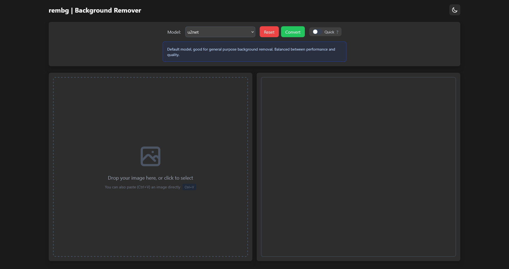

# rembg-web

A simple web interface for [rembg](https://github.com/danielgatis/rembg), allowing you to remove image backgrounds through your browser.



## Setup

1. Install dependencies:
```bash
pip install -r requirements.txt
```

2. Download the model file(s) you want to use (e.g., u2net.onnx) and place them in either:
   - `%USERPROFILE%\.u2net\` (Windows)
   - `~/.u2net/` (Linux/Mac)
   - Or the local `onnx/` directory

You can download the models [here](https://github.com/danielgatis/rembg?tab=readme-ov-file#models).

## Usage

### Manual Run
```bash
python app.py
```
The app should now be accessible at `http://localhost:5000`.

### Run as Windows Service

To install as a Windows service (starts automatically with Windows):
```powershell
# Run PowerShell as Administrator
Set-ExecutionPolicy RemoteSigned
.\install-service.ps1
```

To uninstall:
```powershell
.\uninstall-service.ps1
```

## Features

- Multiple model support (u2net, isnet-anime, etc.)
- Dark mode
- Quick convert mode
- Drag & drop support
- Clipboard paste support

## Libraries used
- [rembg](https://github.com/danielgatis/rembg)
- [Flask](https://github.com/pallets/flask)