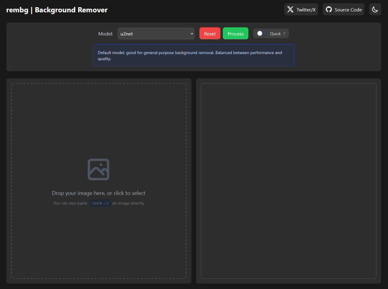

# 🖼️ rembg-web

A simple web-based interface for [rembg](https://github.com/danielgatis/rembg), allowing you to remove image backgrounds locally through your browser.



## 📋 Prerequisites

- [Python](https://www.python.org/) 3.10+
- [CUDA toolkit](https://developer.nvidia.com/cuda-downloads), for GPU accelerated processing on supported NVIDIA graphics card *(optional)*

## Setup

1. Clone the repository:
   ```bash
   git clone https://github.com/narendnp/rembg-web.git
   cd rembg-web
   ```

2. Install dependencies:
   ```bash
   pip install -r requirements.txt
   pip install onnxruntime-gpu>=1.15.0  # For GPU support
   ```

3. Download the model file(s) you want to use:
   ```bash
   python download_models.py
   ```
   Or you can download the models manually [here](https://github.com/danielgatis/rembg?tab=readme-ov-file#models), and place it in:
   - Your home folder's `~/.u2net/` directory (preferred):
      - On Windows: `C:\Users\<YourUsername>\.u2net\`
      - On Linux/Mac: `/home/<YourUsername>/.u2net/`
   - This folder's `onnx/` directory

## Usage

Run the app using:
```bash
python app.py
```
The app should now be accessible at `http://localhost:5000`.

## Install as Service

To install the app as a service (so that the app is automatically running on system boot):

### Windows
- To install the service:
  ```powershell
  # Run PowerShell as Administrator
  Set-ExecutionPolicy Bypass -Scope Process .\scripts\install-service.ps1
  ```

- To uninstall the service:
  ```powershell
  # Run PowerShell as Administrator
  Set-ExecutionPolicy Bypass -Scope Process .\scripts\uninstall-service.ps1
  ```

### Linux
1. Create a systemd unit file:
   ```bash
   sudo nano /etc/systemd/system/rembg-web.service
   ```
2. Inside the file, add the following lines:
   ```bash
   [Unit]
   Description=rembg-web
   After=network.target

   [Service]
   User=youruser  # Replace with your username
   WorkingDirectory=/path/to/rembg-web  # Adjust this path
   ExecStart=/usr/bin/python3 /path/to/rembg-web/app.py  # Adjust this path
   Restart=always

   [Install]
   WantedBy=multi-user.target
   ```
   Save the file and quit nano.
3. Reload systemd, enable the service, and start it:
   ```bash
   sudo systemctl daemon-reload
   sudo systemctl enable rembg-web.service
   sudo systemctl start rembg-web.service
   ```

## Features

- Multiple model for different use cases
- Quick convert mode
- Drag & drop and clipboard paste support

## License

This project is open source. Please check the [license file](LICENSE) for details.

## Acknowledgments

- [rembg](https://github.com/danielgatis/rembg) by Daniel Gatis
